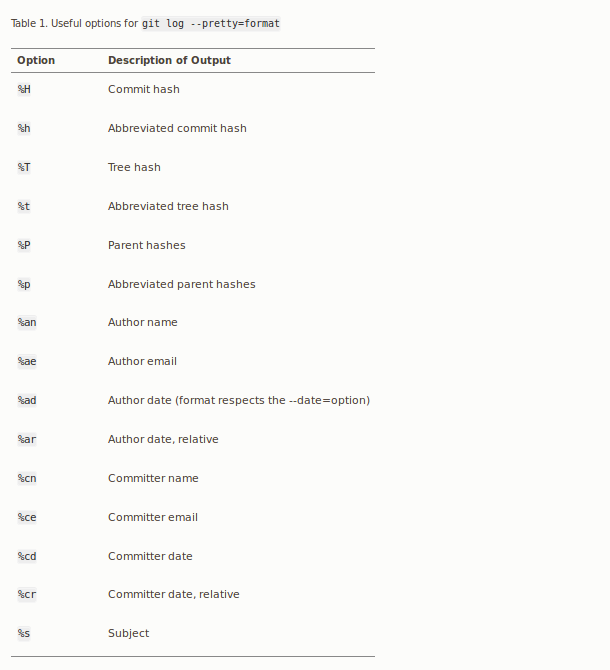
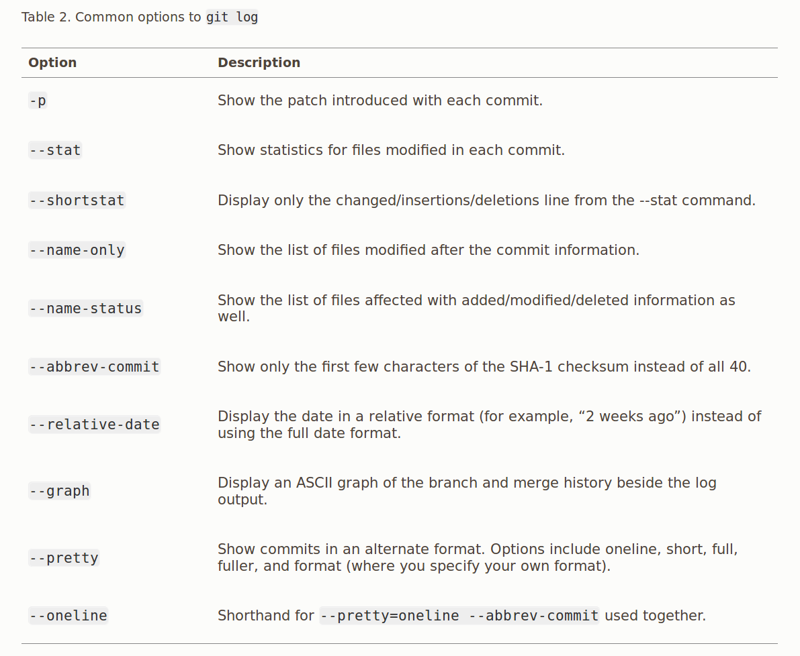

## Git History
`git log` shows the latest commits first - SHA-1 checksum, author's name, email-ID, commit message, date and  time of the commit

**Options:**
- `git log -<max_number_of_req_commits>` : limits the number of commits shown
- `git log -p`, `git log --patch` : Displays the log info showing the differences/modifications introduced in each commit
- `git log --stat` : Gives useful statistics below every commit, the number of files changed, what files are changed, number of insertions/deletions in those files and puts a sumary of the information at the end

#### pretty:
    - `git log --pretty=oneline` : prints out entire SHA hash and the commit message
    - `git log --pretty=format:"......."` : you can customise the output, especially if it is to be parsed by a machine parser - this ensures that this output doesn't change, even if git undergoes some updates. Ex: `git log --pretty=format:"%h - %an, %ar : %s"`

**Difference between Author and Committer:**
If I make any patch to a project, and if a core contributor of the project applies it to the project, then both of us will get the credit. I will get the credit as the author and the person who applies it will get credit as the committer.

`git log --pretty=format:"%h %s" --graph` : gives a nice graph showing the branching and merging.

- Git, by default *pipes* all the outputs through a pager - we see only outputs fitting to a page at a time.
- Time-limiting flags are very useful - `git log --since=2.weeks`, `git log --since="2016-01-15"`
- `git log --grep="param1" --grep="param2"` : Prints commits that match either of the grep commands.
- `git log grep="param1" grep="param2" --all-match"` : Gives the commits that match all of the grep commands.
- `git log -S <function_name>` : 
- `git log --no-merges` : Displays the commits that are not merge commits. This is because, usually merge commits of disparate offer little useful information. 

